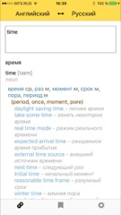
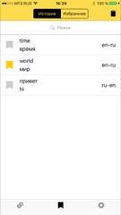

# YandexTranslator
Yandex Translator app written in Swift using the VIPER architecture.

## Frameworks

* [ObjectMapper](https://github.com/Hearst-DD/ObjectMapper)
* [Alamofire](https://github.com/Alamofire/Alamofire) and [AlamofireObjectMapper](https://github.com/tristanhimmelman/AlamofireObjectMapper)
* [RealmSwift](https://github.com/realm/realm-cocoa) and [ObjectMapper+Realm](https://github.com/jakenberg/ObjectMapper-Realm)

## Helpers
* [Generamba](https://github.com/rambler-digital-solutions/Generamba) (automatic VIPER module generator)
* [The Book of VIPER](https://github.com/strongself/The-Book-of-VIPER)

## Screenshots
translate|history|favourites|settings|about
:---:|:---:|:---:|:---:|:---:
||||